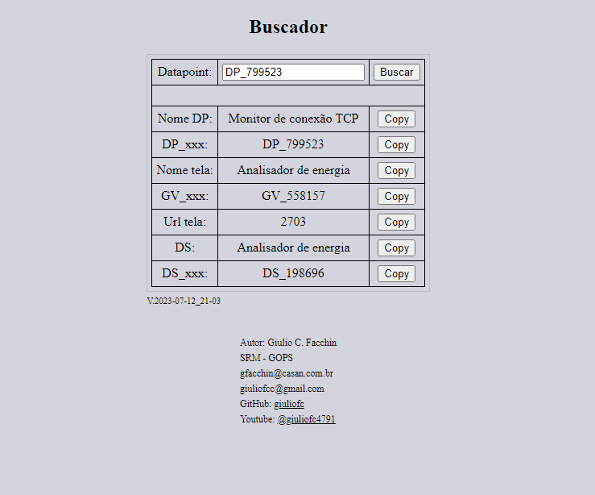

Buscador_fetch_await_async_JSON

Esta aplicação com interface web foi desenvolvida com a finalidade de agilizar o trabalho manual de busca entre  arquivos JSON. Embora seu script esteja estruturado para o JSON em questão, é possível utiliza-la de exemplo e com poucas modificações adaptar para outros JSON.

Também é um bom exemplo de utilização da API Fetch e funções assincronas.

Para testar pesquise por DP_799523 ou DP_186812, os dados nos arquivos JSON são fake mas o arquivo original tem mais de 1 milhão e 200 mil linhas e funciona bem rápido. 

